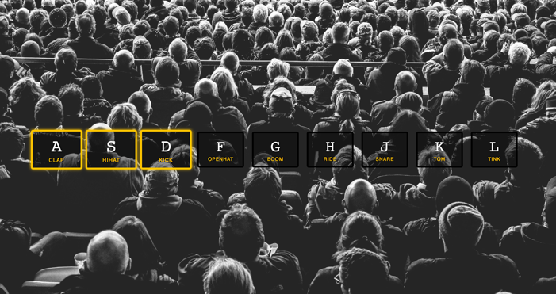

## JavaScript30 Day 1 - JavaScript Drum Kit

In this tutorial, we build a simple interface that has a row of buttons when pressed will play out corresponding unique sound to that key.

Reference: [keycode.info](http://keycode.info)

[View demo site here.](https://webdevtuts.github.io/javascript30_01/)

